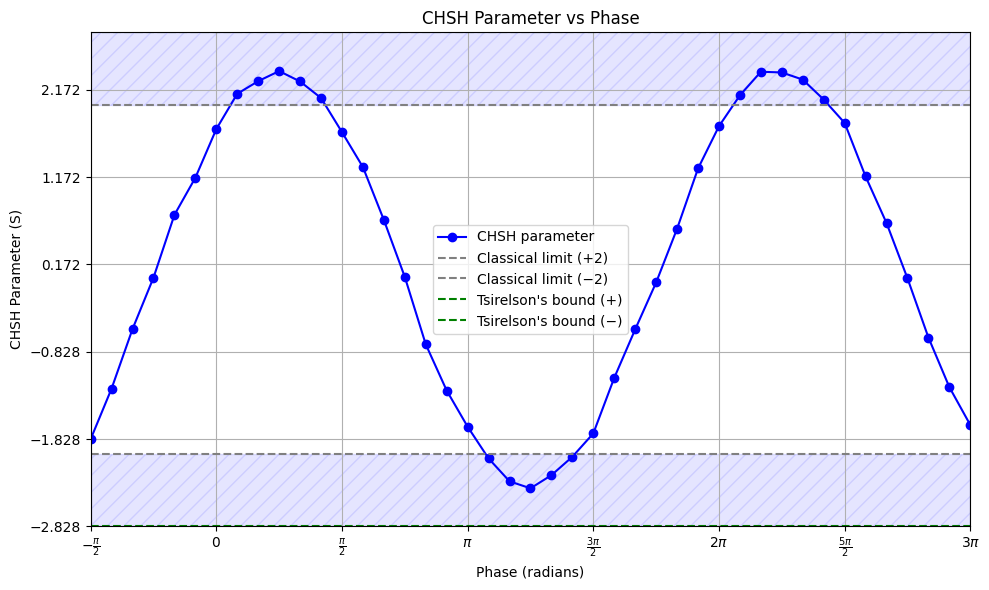

# CHSH-Ineq
Research project on the CHSH inequality

Member Names: Seaena Kim, Adam Jurkowski, Mark Agib

After cloning the repo run
```pip install requirments.txt```
so we can all have the same libraries installed

*Note: So that we don't write over each other make pull requests instead of a direct commit to the main branch.*

All of the code has an associated `README.md` for documentation purposes and [`code/nisq-entaglment/code.ipynb`](code/nisq-entaglment/code.ipynb) has some more markdown for explanations of specfic descions.

Some prelim results. Noisy simulation with noise model from `ibm_brisbane` with diffrent phases for entanglemnt 6 qubits away from each other:


## Research
**(Working) Research Question**: How can the CHSH parameter be used to measure the quality of entanglement on distant qubits based on noisy simulations of quantum computers?

## Notes to the reader
Some papers denote the CHSH inequality a little diffrently. It is denoted as 

$$\left|\text{Tr}\left(\rho\: \mathcal{B}_{CHSH}\right) \right| \leq 2$$

(*Note*: This stems from the fact that the expectation value of a observable is the trace of the density matrix and the obervable.)They describe the CHSH parameter or operator as 

$$\mathcal{B}_{CHSH} = \vec{a} \cdot \vec{\sigma} \otimes \left(\vec{b} +\vec{b}' \right) \cdot \vec{\sigma} + \vec{a}' \cdot \vec{\sigma} \otimes \left(\vec{b} - \vec{b}'\right) \cdot \vec{\sigma}$$

where $\vec{a}$, $\vec{a}'$ and $\vec{b}$, $\vec{b}'$ are unit vecotrs in $\mathfrak{R}^3$ and describe the measurments on Alice and Bob's sides, respectively and $\sigma$ are vectors of the pauli matrices. (*Note*: Taking the dot product of alice's unit vecotr and the pauli matrix is an oberservable and it corresponds to measuring on the pauli matrice's axis.) On a futher side note (skip ahead if you understand) the correlation functions described in the classic CHSH expression $E(a, b)$ can be written mathematically as 

$E(\vec{a},\vec{b}) = \text{Tr} \left[\rho \left(\vec{a} \cdot \vec{\sigma} \otimes \vec{b} \cdot \vec{\sigma} \right) \right]$

and so when we substitute in for those terms we get

$$ \text{Tr} \left[ \rho \left(\vec{a} \cdot \vec{\sigma} \otimes \vec{b}\cdot \vec{\sigma} + \vec{a} \cdot \vec{\sigma} \otimes \vec{b}' \cdot\vec{\sigma} + \vec{a}' \cdot \vec{\sigma} \otimes \vec{b} \cdot \vec{\sigma} - \vec{a}' \cdot \vec{\sigma} \otimes \vec{b}' \cdot \vec{\sigma} \right) \right] $$

(pretty long lol). But once we group (try this yourself) we get

$$\vec{a} \cdot \vec{\sigma} \otimes \left(\vec{b} +\vec{b}' \right) \cdot \vec{\sigma} + \vec{a}' \cdot \vec{\sigma} \otimes \left(\vec{b} - \vec{b}'\right) \cdot \vec{\sigma}$$

which happens to be excatly what the CHSH operator was (check for yourself). That's becuase these are equivalent ways to write the same thing.


And the density matrix $\rho$ can be expressed as 

$$\rho = \frac{1}{4}\left(I\otimes I + \vec{r} \cdot \vec{\sigma} \otimes I + I \otimes \vec{s} \cdot \vec{\sigma} + \sum_{n, m = 1}^{3}{T_{n,m}\sigma_n \otimes \sigma_m}\right) $$

