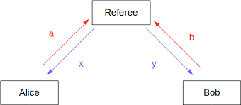
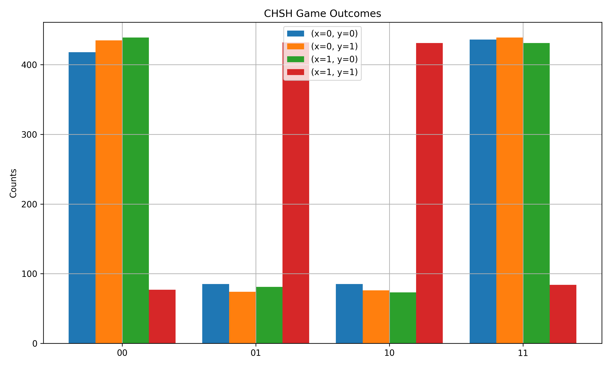

## Classic CHSH Game
The code in this folder is for a classical CHSH game between Alice and Bob. 

In the code example alice is one qubit and bob is another. The goal of the game is to fullfil the equality $$x \wedge y = a \oplus b$$ given $x, y$ which are either $1$ or $0$ and Alice and Bob respond with $a, b$. XOR (or $\oplus$) returns $1$ if one of its inputs is $1$ and logical AND ($\wedge$) returns $1$ when both inputs are the same.

With classical techinquies this is only winable up to 75% of the time, but with quantum techinques we can win up to about 85% of the time (given by Tsirelson’s bound).

The ciruit I implent sets up Alice and Bob in a bell state (specifically $|\phi_0\rangle = \frac{1}{\sqrt2}(|00\rangle + |11\rangle$) and then proceds to change the measurment basis depending on the given $x, y$. If `x == 0` then Alice measures in the normal Z-basis and if `x == 1` then she measures in the X-basis (hence the applicaiton of the Hadamard). If `x == 0` then Bob measures in the $\frac{Z + X}{\sqrt2}$ basis and if `x == 1` then she measures in the $\frac{Z - X}{\sqrt2}$ basis. I changed the basis for bob by applying rotation gates in the y-axis (ex:`circuit.append(cirq.ry(np.pi / 4)(b))`).

We then create circuits for all the possible $x,y$ pairs and simulate $1024$ times on cirq's simulator. We then count the results from measurments and place them into pairs. A simple histogram is plotted as shown below.

We then generate expecation valeues based on the given $x,y$ pairs. And using $$S = E(0,0) + E(0,1) + E(1,0) - E(1,1)$$ we find that the value is near the maximun $2\sqrt2 \approx2.828$ which is $\geq 2$ violating the CHSH inequality.

In papres they often refer to a "correlator" in the form $$\langle \psi| C|\psi\rangle$$ (an expecation value of $C$) where $C$ is the Hermitian Bell-CHSH operator $$C = (A +A')B + (A-A')B'$$ where $(A, A')$ and $(B, B')$ are the Bell opeartors (A for alice and B for Bob's operators). Note that Alice's opeartors commute with Bob's operators act on seperate hilbert spaces. This is simply a more mathematical way to communicate the inequaility. 

TODO: Add ciations

I'll add more documentation explaing how it works.
