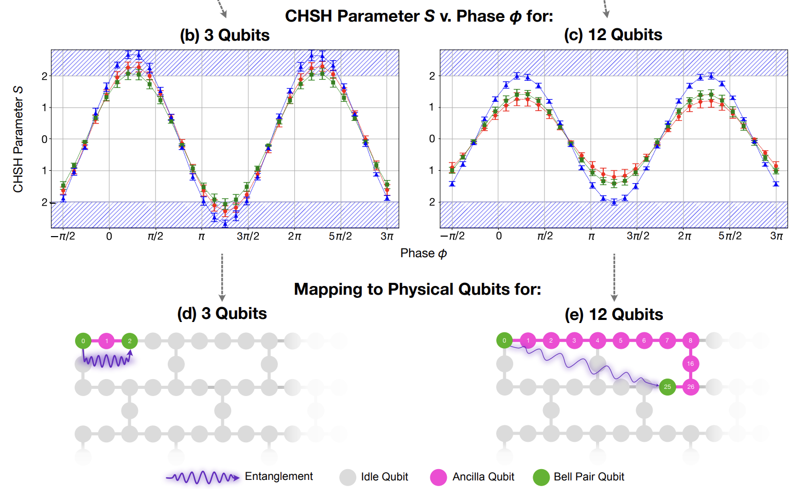
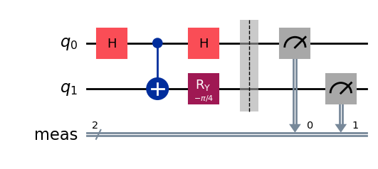
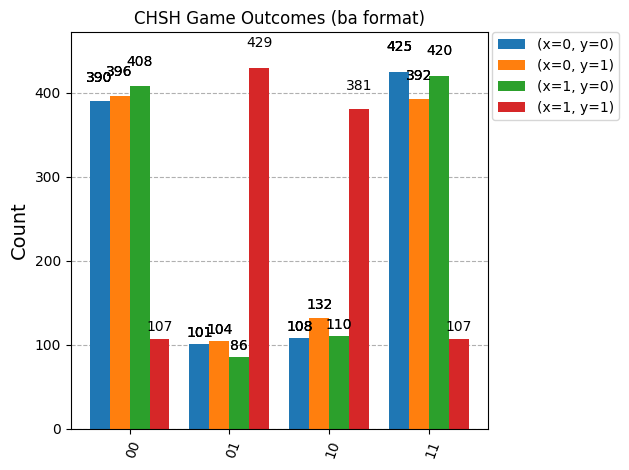
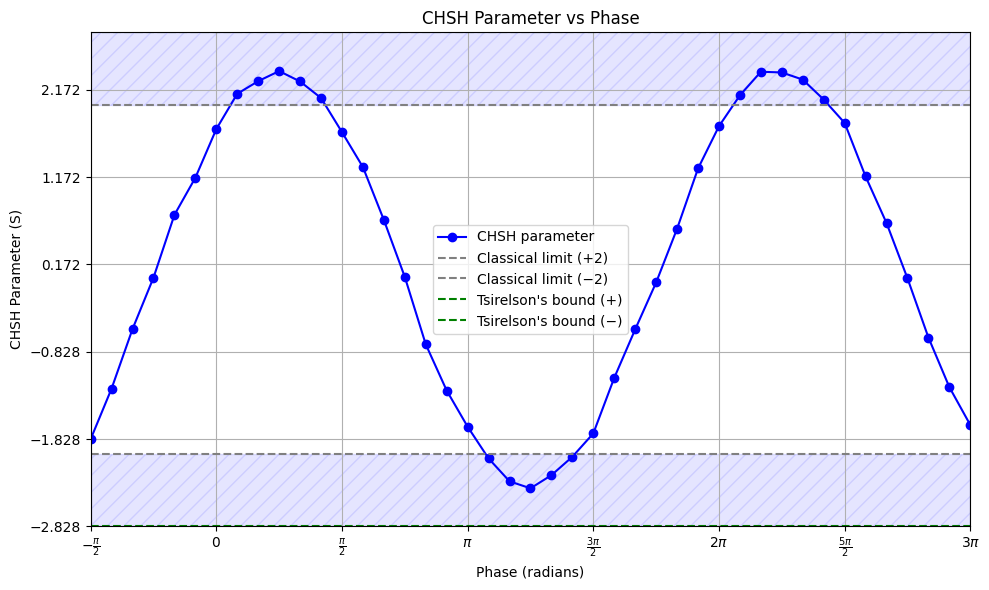

## Evaluating entanglment on NISQ devices using CHSH 
Trying to evaluate how well entanglemnt works between qubits that are very far part (like 15 qubits) by using the CHSH inequality and comapring diffrent ways to implemnt a long range CNOT.

Great image from paper that shows what happens when we try to entangle qubits much farther apart. (https://arxiv.org/pdf/2504.18429v1) *Note: blue dashed area is where CHSH is violated and diffrent colors represnet diffrent CNOT methods*

Circuit that we constructed for CHSH inequality considering $(x,y) = (1, 0)$

TODO: Figure out ways were going to implement CNOTS across multiple qubits and use it for a quick noisy sim than we could do real hardware.

Used the noise model from `ibm_brisbane` and made CHSH circuit with a distance of $10$ in betwen the two qubits. We calcuated $S = 2.33$ for the below simulation which was much lower than the previous exact simulation we were getting. So far it is still $\geq 2$ and violating CHSH inequality. May be becuase real life has even more un expected noise.

Finally a good graph (for distance of 6 qubits): 